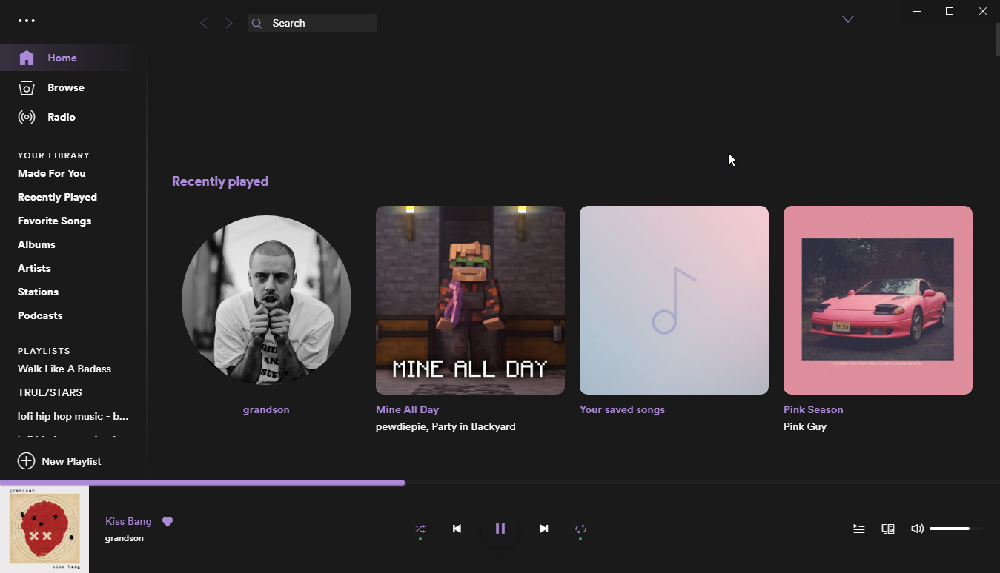

# Twitchy

A theme for [spicetify](https://github.com/khanhas/spicetify-cli), made to look like twitch.tv's UI (purple on black)

## Screenshots

## Installation

- Create a folder called `Twitchy` in `%USERPROFILE%/.spicetify/Themes/` and copy the files there
- Apply the theme by running `spicetify config current_theme Twitchy`
- Revert to the default Spicetify theme by running `spicetify config current_theme SpicetifyDefault`